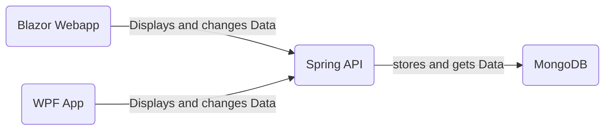

# Notiz API 
Florian Koessler 
HTL-Saalfelden
# Software Design

Dieses Projekt beinhaltet eine API um Notizen zu Verwatlen, sowie zwei Clients, eine WPF-Anwendung und eine Website umgesetzt mit .net Blazor-WebAssembly.

Das folgende Diagramm zeigt die 3 Komponenten, und wie sie miteinander interagieren:


## Spring REST API

Die API ist das Kernstück dieses Projektes, sie wurde mithilfe des Spring Boot Frameworks in Java erstellt. Die API ist für die Verwatlung und Speicherung der Daten in einer MongoDB Datenbank zuständig.  Das Spring-Rest Projekt besteht aus verschiedenen Komponenten, welche eng miteinander interagieren. 

Das folgende Diagramm veranschaulicht die einzelnen Komponenenten und ihre Beziehungen:

```mermaid
classDiagram 
	MongoRepository <|-- NotizRepository
	NotizRepository "1" -- "1" NotizService :uses
	NotizService "1" -- "1" NotizController :uses
	Notiz "*" -- "1" NotizService :has
	MongoRepository <|-- SettingsRepository
	SettingsRepository "1" -- "1" SettingsService :uses
	SettingsService "1" -- "1" NotizController :uses
	Settings "1" -- "1" SettingsService :has
	class NotizController{
	-Rest Endpoints
	}
	class NotizRepository{
	}
	class MongoRepository{
	}
	class NotizService{
	-Crud Operationen
	}
	class Notiz{
	+id
	+titel
	+text
	+creationDate
	-getter & setter
	}
	class Settings{
	+id
	+darkMode
	+titleMDPrefix
	}
	class SettingsRepository{
	}
	class SettingsService{
	-Crud Operationen
	}
````
Der "NotizController" ist die zentrale Komponente, welche Anfragen von den Clients entgegennimmt und entsprechend weiterleitet. Eine Anfrage wird duch REST-Endpoints entrsprechenden der HTTP-Methode einer Funktion zugewiesen und es wird eine Methode in der Klasse "NotizService" aufgerufen, welche die Notizen, wie in der Anfrage spezifiziert, verändert.

## WPF-Client

Ein Client wurde mit dem Windows Presentation Format (WPF) erstellt. Im WPF-Client kann der User neue Notizen erstellen, alle gespeicherten Notizen anzeigen, Notizen bearbeiten oder löschen.

Dieses Diagramm zeigt den Aufbau der WPF-Anwendung:

```mermaid
classDiagram 
	MainWindow "1" -- "*" Notiz :manages
	EditWindow "1" -- "1" Notiz :edits
	class MainWindow{
	+ notizen List Notiz
	}
	class EditWindow{
	}
	class Notiz{
	+id
	+titel
	+text
	+creationDate
	-getter & setter
	}
````
Das Hauptgeschehen des WPF-CLients geschieht auf dem "MainWindow", hier werden die Notizen erstellt, eingelesen oder gelöscht. Bei der Verarbeitung von Notizen öffnet sich das "EditWindow" in dem man mit 2 TextBoxen den Title sowie den Text der Notiz editieren kann.

## Blazor-WebAPP

Auf der Website kann der User wie auch schon bei der WPF-APP neue Notizen erstellen, alle gespeicherten Notizen anzeigen, Notizen bearbeiten oder löschen. Ebenfalls gibt es hier noch Settings um einfache Einstellungen für die Anzeige der Notizen zu betätigen (URL der API ändern, wechsel zwischen Lightmode und Darkmode & Markdown-Formatierung des Titels)

Dieses Diagramm zeigt den Aufbau der Blazor-Web APP:

```mermaid
classDiagram 
	IndexPage "1" -- "*" Notiz :manages
	IndexPage "1" -- "1" Settings :uses
	SettingsPage "1" -- "1" Settings :manages
	class IndexPage{
	+ notizen List Notiz
	}
	class SettingsPage{
	}
	class Notiz{
	+id
	+titel
	+text
	+creationDate
	-getter & setter
	}
	class Settings{
	+darkMode
	+titleMDPrefix
	-getter & setter
	}
````

Die Hauptseite der Webiste ist die "IndexPage" hier werden alle Notizen eingelesen, gespeichert  editert oder gelöscht. Auf der "SettingsPage" können einstellungen getroffen werden welche die Anzeige von Notizen und das Generelle aussehen des Clients betreffen.
# Beschreibung der Software 
## Notiz API
## WPF-APP
## Website mit Blazor Webassembly


# API-Beschreibung 
## Overview
Diese API ermoeglicht es Notizen in einer MongoDB Datenbank zu speichern und diese wieder auszulesen. Die API verfügt über die Basic Crud Operatinen: Get, Post, Put & Delete. Des weiteren ist es möglich Einstellungen, für mögliche Clients (in diesem Fal die Blazor WebApp), zu speichern. 
Die Url zur API ist folgendermaßen aufgebaut: http://{ip}:4200, {ip} ist die IP-Adresse des Servers auf dem die API läuft.

Das Datenaustausch-Format um mit der API zu kommunizieren ist JSON
## Datentypen und Endpoints
### Status über /status
 /status stellt einen Health Check für die API dar

#### Verwendung:
- <details>
 <summary><code>GET</code> <code><b>/status</b></code> <code>gibt den Status der API zurueck</code></summary></summary>
	Response


	|content-type              | response example / description            |                                                    
	|------------------------|--------------------------------------------------|
	|`json string`  | `{"success":"true","message":"Das Service ist verfügbar!"}`            |
### Notizen über /notiz
/notiz ist der Endpunkt um die Notizen zu speichern, auszulesen, zu ändern oder zu löschen.

Parameter der Notizen

| name   |  type      | data type      | description                                          
	|--------------- |--------------------|-------------|---------------------------------------------|
	| `id`                  |  auto generated  | string         | Einzigartige ID                                          |
	| `titel`             |  -            | string         | Titel der Notiz                                          |
	| `text`               |  -            | string         | Text der Notiz                                          |
	| `creationDate` |  -            | string         | Datum und Uhrzeit der Erstellung           |
	| `tag` |  -            | string         | tag um Notizen zu Kategorisieren           |
#### Verwendung: 

 - <details>
 <summary><code>GET</code> <code><b>/</b></code> <code>gibt eine Liste aller Notizen zurueck</code></summary></summary>
	Responses
	
	|content-type             | response example / description                                       |
	 |-------------------------|-----------------------------------------------------------|
	 |`json string`       | `JSON Liste aller Notizen`                                                          |
	Sample Response:
	
		[{
 			"id":string,
 			"titel":string,
 			"text":string,
 			"creationDate":string,
 			"tag":string
		},
		{
			"id":string,
			"titel":string,
			"text":string,
			"creationDate":string
			"tag": string
		}]

 - <details>
 <summary><code>GET</code> <code><b>/{id}</b></code> <code>gibt die Notiz mit dern angegebenen id {id} zurueck</code></summary></summary>
	 Parameters

	| data type      | type                | format                  | description                                   |
	|---------------|-----------------|----------------------------|-------------------------------|
	| String             | Path  | String  | {id} der gewünschten Notiz  |
	 
	 Responses
	
	|content-type             | response example / description                                       |
	 |-------------------------|-----------------------------------------------------------|
	 |`json string`       | `JSON Objekt der gewünschten Notiz`                                                          |
	 
	 Sample Respone: 

		{
 			"id":string,
 			"titel":string,
 			"text":string,
 			"creationDate":string,
 			"tag":string
		}
 -  <details>
 <summary><code>Post</code> <code><b>/notiz</b></code> <code>speichert eine neue Notiz</code></summary></summary>
	 Parameters

	| data type      | type                | format                  | description                                   |
	|---------------|-----------------|----------------------------|-------------------------------|
	| Notiz             | Requestbody   | object (JSON)   | Json Objekt der Notiz  |

	Responses
	
	 |content-type        | response example / description                                                      |
	|---------------------|--------------------------------------------------------------------------------|
	|`json string`        | `{"success":"true","message":"Notiz has been added successfully"}`                             |
 -  <details>
 <summary><code>PUT</code> <code><b>/notiz</b></code> <code>updatet eine bereits vorhandene Notiz</code></summary></summary>
	 Parameters

	| data type | type           | format                | description                   |
	|---------------|-----------------|-----------------------|-------------------------|
	| Notiz          | Requestbody   | object (JSON)   | Json Objekt der Notiz  |

	Responses
	
	 |content-type        | response example / description                                                      |
	|---------------------|--------------------------------------------------------------------------------|
	|`json string`        | `{"success":"true","message":"Notiz has been updated successfully"}`                             |
 -  <details>
 <summary><code>DELETE</code> <code><b>/notiz/{id}</b></code> <code>löscht eine Notiz</code></summary></summary>
	Parameters

	 | data type | type           | format                | description                   |
	|---------------|-----------------|-----------------------|-------------------------|
	| String          | Path   | String   | {id} der zu loeschenden Notiz  |

	Responses
	
	 |content-type        | response example / description                                                      |
	|---------------------|--------------------------------------------------------------------------------|
	|`json string`        | `{"success":"true","message":"Notiz has been deleted successfully"}`                             |
### Settings über /settings
Mit /settings kann man die gespeicherten Einstellungen Verändern oder auslesen.

Parameter der Settings

| name   |  type      | data type      | description                                          
	|--------------- |--------------------|-------------|---------------------------------------------|
	| `darkMode`                  |  - | bool         | bestimmt über das Theme des Clients                                        |
	| `titelMDPrefix`             |  -            | string         | Markdown Formatierung des Titels im Client|
#### Verwendung:
 -  <details>
 <summary><code>GET</code> <code><b>/settings</b></code> <code>gibt die derzeitigen Settings zurück</code></summary></summary>
	Responses
	
	|content-type             | response example / description                                       |
	 |-------------------------|-----------------------------------------------------------|
	 |`json string`       | `JSON Objekt der Settings`                                                          |
	 
	 Sample Respone: 

		{
 			"dakrmode":bool,
 			"titelMDPrefix":string
		}
 -  <details>
 <summary><code>PUT</code> <code><b>/settings</b></code> <code>updatet die gespeicherten Settings</code></summary></summary>
	Parameters

	| data type | type           | format                | description                   |
	|---------------|-----------------|-----------------------|-------------------------|
	| Settings          | Requestbody   | object (JSON)   | Json Objekt der Settings  |

	Responses
	
	 |content-type        | response example / description                                                      |
	|---------------------|--------------------------------------------------------------------------------|
	|`json string`        | `{"success":"true","message":"Settings have been updated successfully"}`                             |
# Ev. Diagramme (Use-Cases, Übersichtsdiagramme) 
# Diskussion der Ergebnisse (Zusammenfassung, Hintergründe, Ausblick, etc.) 
# Quellenverzeichnis / Links 