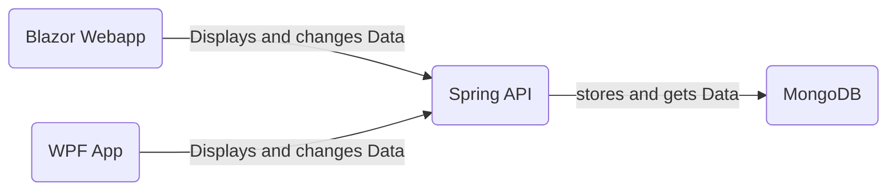

# Notiz API 
Das diesjährige Semesterprojekt im Fach Programmieren und Softwareentwicklung (kurz "POS") drehte sich um REST API's. Wie der Name schon sagt ist Notiz API eine Arbeit dieses Projektes, welche sich mit der Verwaltung von Notizen auseinandersetzt. Die Anforderungen für dieses Projekt beinhalten eine API, sowie zwei Clients welche mit der API interagieren.  Einer der Clients sollte als WPF-Anwendung und der andere als Website realisiert werden.

## Inhaltsverzeichnis
- [Software Design](#Softwaredesign)
- [Beschreibung der Software](#beschreibung-der-software)
- [API Beschreibung](#api-beschreibung)
- [Diskussion](#diskussion)
## Softwaredesign

Dieses Projekt beinhaltet eine API um Notizen zu Verwatlen, sowie zwei Clients, eine WPF-Anwendung und eine Website umgesetzt mit .net Blazor-WebAssembly.

Das folgende Diagramm zeigt die 3 Komponenten, und wie sie miteinander interagieren:


### Spring REST API

Die API ist das Kernstück dieses Projektes, sie wurde mithilfe des Spring Boot Frameworks in Java erstellt. Die API ist für die Verwatlung und Speicherung der Daten in einer MongoDB Datenbank zuständig.  Das Spring-Rest Projekt besteht aus verschiedenen Komponenten, welche eng miteinander interagieren. 

Das folgende Diagramm veranschaulicht die einzelnen Komponenenten und ihre Beziehungen:

```mermaid
classDiagram 
	MongoRepository <|-- NotizRepository
	NotizRepository "1" -- "1" NotizService :uses
	NotizService "1" -- "1" NotizController :uses
	Notiz "*" -- "1" NotizService :has
	MongoRepository <|-- SettingsRepository
	SettingsRepository "1" -- "1" SettingsService :uses
	SettingsService "1" -- "1" NotizController :uses
	Settings "1" -- "1" SettingsService :has
	class NotizController{
	-Rest Endpoints
	}
	class NotizRepository{
	}
	class MongoRepository{
	}
	class NotizService{
	-Crud Operationen
	}
	class Notiz{
	+id
	+titel
	+text
	+creationDate
	-getter & setter
	}
	class Settings{
	+id
	+darkMode
	+titleMDPrefix
	}
	class SettingsRepository{
	}
	class SettingsService{
	-Crud Operationen
	}
````
Der "NotizController" ist die zentrale Komponente, welche Anfragen von den Clients entgegennimmt und entsprechend weiterleitet. Eine Anfrage wird duch REST-Endpoints entrsprechenden der HTTP-Methode einer Funktion zugewiesen und es wird eine Methode in der Klasse "NotizService" aufgerufen, welche die Notizen, wie in der Anfrage spezifiziert, verändert.

### WPF-Client

Ein Client wurde mit dem Windows Presentation Format (WPF) erstellt. Im WPF-Client kann der User neue Notizen erstellen, alle gespeicherten Notizen anzeigen, Notizen bearbeiten oder löschen.

Dieses Diagramm zeigt den Aufbau der WPF-Anwendung:

```mermaid
classDiagram 
	MainWindow "1" -- "*" Notiz :manages
	EditWindow "1" -- "1" Notiz :edits
	class MainWindow{
	+ notizen List Notiz
	}
	class EditWindow{
	}
	class Notiz{
	+id
	+titel
	+text
	+creationDate
	-getter & setter
	}
````
Das Hauptgeschehen des WPF-CLients geschieht auf dem "MainWindow", hier werden die Notizen erstellt, eingelesen oder gelöscht. Bei der Verarbeitung von Notizen öffnet sich das "EditWindow" in dem man mit 2 TextBoxen den Title sowie den Text der Notiz editieren kann.

### Blazor-WebAPP

Auf der Website kann der User wie auch schon bei der WPF-APP neue Notizen erstellen, alle gespeicherten Notizen anzeigen, Notizen bearbeiten oder löschen. Ebenfalls gibt es hier noch Settings um einfache Einstellungen für die Anzeige der Notizen zu betätigen (URL der API ändern, wechsel zwischen Lightmode und Darkmode & Markdown-Formatierung des Titels)

Dieses Diagramm zeigt den Aufbau der Blazor-Web APP:

```mermaid
classDiagram 
	IndexPage "1" -- "*" Notiz :manages
	IndexPage "1" -- "1" Settings :uses
	SettingsPage "1" -- "1" Settings :manages
	class IndexPage{
	+ notizen List Notiz
	}
	class SettingsPage{
	}
	class Notiz{
	+id
	+titel
	+text
	+creationDate
	-getter & setter
	}
	class Settings{
	+darkMode
	+titleMDPrefix
	-getter & setter
	}
````

Die Hauptseite der Webiste ist die "IndexPage" hier werden alle Notizen eingelesen, gespeichert  editert oder gelöscht. Auf der "SettingsPage" können einstellungen getroffen werden welche die Anzeige von Notizen und das Generelle aussehen des Clients betreffen.
## Beschreibung der Software 
### Notiz API
Das Kernelement des Projektes, die API, wurde wie zuvor bereits im Punkt Software Design beschrieben, in Java mit Spring Boot entwickelt. Für die Spring Boot API wurden die folgenden Dependencies verwendet: 
```xml 
<dependencies>
	<dependency>
		<groupId>org.springframework.boot</groupId>
		<artifactId>spring-boot-starter-data-mongodb</artifactId>
	</dependency>
	<dependency>
		<groupId>org.springframework.boot</groupId>
		<artifactId>spring-boot-starter-web</artifactId>
	</dependency>
	<dependency>
		<groupId>org.springframework.boot</groupId>
		<artifactId>spring-boot-starter-test</artifactId>
		<scope>test</scope>
	</dependency>
</dependencies>
```

Zur Verwendung der API wurden mehrere Endpoints implementiert welche die benötigten Funktionalitäten der API bereitstellen. Zur Veranschaulichung wie ein solcher Endpoint in Java implementiert wurde zeigt folgender Codeabschnitt die Implementierung des Endpoints <code><b>/status</b></code>
```java
@RequestMapping("/status")
public String serviceTest() {
	return "Der Service funktioniert";
}
```
Eine detaillierte Beschreibung der einzelnen Endpoints inklusive ihrer Verwendung ist unter dem Punkt API-Beschreibung auffindbar.
### WPF-APP
Der WPF-Client wurde in C# entwickelt und für alle JSON konvertierungsaufgaben wurde das Newtonsoft Json.Net Nuget verwendet. Die wichtigsten Codeteile, die Implementierung der CRUD-Operationen mit zugriffen auf die API werden im folgendem Abschnitt veranschaulicht.
#### GET
```c#
HttpClient httpclient = new HttpClient();

string data = "";
data = httpclient.GetStringAsync(apiurl).Result;

var list = JsonSerializer.Deserialize<List<Notiz>>(data);
if (list != null)
{
	foreach (Notiz n in list)
	{
		newNote(n.titel, n.text,n.id,n.creationDate,n.tag);
	}
}
```
Hier wird der Endpunkt<code><b>/notiz</b></code> mit HTTP-Methode GET verwendet um eine Liste aller Notizen zu erhalten. Die Methode <code>NewNote</code> dient dazu, die gespeicherten Notizen als Objekte der selbst erstellten c# Klasse <code>Notiz</code>zu erstellen, und diese in der Anwendung darzustellen.
#### POST
```c#
HttpClient httpclient = new HttpClient();
var noteJson = JsonSerializer.Serialize(n);
var requestContent = new StringContent(noteJson, Encoding.UTF8, "application/json");

var response = httpclient.PostAsync(apiurl, requestContent);
```
Hier wird die Notiz <code>n</code> als Json string serialisiert und an den API Endpunkt<code><b>/noitz</b></code> mit der HTTP-Methode POST gesendet.
#### PUT
```c#
HttpClient httpclient = new HttpClient();
var noteJson = JsonSerializer.Serialize(n);
var requestContent = new StringContent(noteJson, Encoding.UTF8, "application/json");

var response = httpclient.PutAsync(apiurl + "/"+n.id, requestContent);
```
Hier wird die Notiz <code>n</code> ebenfalls als Json string serialisiert und an den API Endpunkt <code><b>/noitz/{id}</b></code> mit der HTTP-Methode PUT gesendet.
#### DELETE
```c#
HttpClient httpclient = new HttpClient();

int index = NoteList.SelectedIndex;
Notiz n = notes[index];

var response = httpclient.DeleteAsync(apiurl+"/" + n.id);
```
Hier wird der API Endpunkt <code><b>/noitz/{id}</b></code> mit der HTTP-Methode DELETE verwendet um die ausgewählte Notiz zu löschen.

### Website mit Blazor Webassembly
Die Website wurde mithilfe des ASP.net Blazor Webframeworks erstellt. Da die Website und auch der WPF-CLient in c# implementiert wurde ähnelt sich der Code der beiden Clients in vielen Bereichen, besonders die CRUD-Operationen sind fast ident.  Die wichtigsten Teile des Codes dieser Website werden im folgendem Abschnitt behandelt.
#### GET-Request
Die Methode <code>loadNotes.cs</code> wird verwendet um die Notizen aus der API in den Client zu laden, sie wird beim initialisieren der Seite aufgerufen.
```c#
protected void loadNotes()
{
	try
	{
		HttpClient httpclient = new HttpClient();

		string data = "";
		data = httpclient.GetStringAsync(apiurl).Result;
		notes = System.Text.Json.JsonSerializer.Deserialize<List<Notiz>>(data);

		foreach(Notiz n in notes)
		{
			if (!tags.Contains(n.tag)&&n.tag!=null)
			{
				tags.Add(n.tag);
			}
		}
	}
	catch (Exception ex)
	{
		Console.WriteLine(ex.message);
	}
}
```
Der Wert <code>tag</code> der Notizen wird in einer Liste gespeichert, um eine Dropdown Liste mit diesen Tags zu befüllen. Über dieses Auswahlfenster können die angezeigten Notizen gefiltert werden um nur Notizen von einem oder mehreren ausgewählten Tags anzeigen zu lassen.
#### Settings
Die Settings dienen dazu bestimmte Einstellungen mithilfe der API zu speichern und für die WebApp anzuwenden. Die Klasse <code>Settings</code> ist in folgendem Codeausschnitt zu sehen:
```c#
public class Settings
    {
        public bool darkMode { get; set; }
        public string titleMDPrefix { get; set; }
        public String apiUrl { get; set; }

        public Settings()
        {
            this.apiUrl = "http://localhost:4200"; //default value
            try
            {
                HttpClient httpclient = new HttpClient();
                string data = "";
                data = httpclient.GetStringAsync(apiUrl + "/settings").Result;

                dynamic obj = JsonConvert.DeserializeObject(data);

                this.darkMode = (bool)obj.darkMode;
                if((string)obj.titleMDPrefix != null)
                {
                    this.titleMDPrefix = (string) obj.titleMDPrefix;
                }
                else
                {
                    this.titleMDPrefix = "# ";
                }
            }
            catch (Exception ex)
            {

            }
        }
        public Settings(bool dakrMode, string titleMDPrefix)
        {
            this.darkMode = dakrMode;
            this.titleMDPrefix = titleMDPrefix;
        }
    }
```
Wie hier zu sehen ist werden im Konstruktor ohne mitgegebenen werten die Settings aus der API geladen. Hierzu wird die API mit dem url standartwert <code>localhost:4200</code>. 

Eine Instanz der Settings Klasse wird beim Starten der Anwendung als Singleton geladen, um Differenzen in den Einstellungen zwischen den verschiedenen Seiten zu vermeiden. Dies wird durch folgenden Code im Skript <code>Program.cs</code> erreicht: 
```c#
builder.Services.AddSingleton<Settings>();
```

## API-Beschreibung 
Diese API ermoeglicht es Notizen in einer MongoDB Datenbank zu speichern und diese wieder auszulesen. Die API verfügt über die Basic Crud Operatinen: Get, Post, Put & Delete. Des weiteren ist es möglich Einstellungen, für mögliche Clients (in diesem Fal die Blazor WebApp), zu speichern. 
Die Url zur API ist folgendermaßen aufgebaut: http://{ip}:4200, {ip} ist die IP-Adresse des Servers auf dem die API läuft.

Das Datenaustausch-Format um mit der API zu kommunizieren ist JSON
### Datentypen und Endpoints
#### Status über /status
 /status stellt einen Health Check für die API dar

##### Verwendung:
<details>
 	<summary><code>GET</code> <code><b>/status</b></code> <code>gibt den Status der API zurueck</code></summary></summary>
	Response
	
|content-type              | response example / description            |               
|------------------------|--------------------------------------------------|
|`json string`  | `{"success":"true","message":"Das Service ist verfügbar!"}`        |
		
</details>

#### Notizen über /notiz
/notiz ist der Endpunkt um die Notizen zu speichern, auszulesen, zu ändern oder zu löschen.

Parameter der Notizen

| name   |  type      | data type      | description                                          
|--------------- |--------------------|-------------|---------------------------------------------|
| `id`                  |  auto generated  | string         | Einzigartige ID                                          |
| `titel`             |  -            | string         | Titel der Notiz                                          |
| `text`               |  -            | string         | Text der Notiz                                          |
| `creationDate` |  -            | string         | Datum und Uhrzeit der Erstellung           |
| `tag` |  -            | string         | tag um Notizen zu Kategorisieren           |

##### Verwendung: 

 <details>
 <summary><code>GET</code> <code><b>/notiz</b></code> <code>gibt eine Liste aller Notizen zurueck</code></summary></summary>
Responses
	
|content-type             | response example / description                                       |
|-------------------------|-----------------------------------------------------------|
|`json string`       | `JSON Liste aller Notizen`                                                          |
Sample Response:
	
	[{
		"id":string,
		"titel":string,
		"text":string,
		"creationDate":string,
		"tag":string
	},
	{
		"id":string,
		"titel":string,
		"text":string,
		"creationDate":string
		"tag": string
	}]
</details>
 <details>
 <summary><code>GET</code> <code><b>/notiz/{id}</b></code> <code>gibt die Notiz mit dern angegebenen id {id} zurueck</code></summary></summary>
 Parameters

| data type      | type                | format                  | description                                   |
|---------------|-----------------|----------------------------|-------------------------------|
| String             | Path  | String  | {id} der gewünschten Notiz  |
	 
 Responses
	
|content-type             | response example / description                                       |
|-------------------------|-----------------------------------------------------------|
|`json string`       | `JSON Objekt der gewünschten Notiz`                                                          |
	 
 Sample Respone: 

	{
		"id":string,
		"titel":string,
		"text":string,
		"creationDate":string,
		"tag":string
	}
 </details>
 <details>
 <summary><code>Post</code> <code><b>/notiz</b></code> <code>speichert eine neue Notiz</code></summary></summary>
	 Parameters

| data type      | type                | format                  | description                                   |
|---------------|-----------------|----------------------------|-------------------------------|
| Notiz             | Requestbody   | object (JSON)   | Json Objekt der Notiz  |

Responses
	
|content-type        | response example / description                                                      |
|---------------------|--------------------------------------------------------------------------------|
|`json string`        | `{"success":"true","message":"Notiz has been added successfully"}`                             |
 </details>
 <details>
 <summary><code>PUT</code> <code><b>/notiz</b></code> <code>updatet eine bereits vorhandene Notiz</code></summary></summary>
 Parameters

| data type | type           | format                | description                   |
|---------------|-----------------|-----------------------|-------------------------|
| Notiz          | Requestbody   | object (JSON)   | Json Objekt der Notiz  |

Responses
	
|content-type        | response example / description                                                      |
|---------------------|--------------------------------------------------------------------------------|
|`json string`        | `{"success":"true","message":"Notiz has been updated successfully"}`                             |
 </details>
 <details>
 <summary><code>DELETE</code> <code><b>/notiz/{id}</b></code> <code>löscht eine Notiz</code></summary></summary>
	Parameters

| data type | type           | format                | description                   |
|---------------|-----------------|-----------------------|-------------------------|
| String          | Path   | String   | {id} der zu loeschenden Notiz  |

Responses
	
|content-type        | response example / description                                                      |
|---------------------|--------------------------------------------------------------------------------|
|`json string`        | `{"success":"true","message":"Notiz has been deleted successfully"}`                             |

</details>#

#### Settings über /settings
Mit /settings kann man die gespeicherten Einstellungen Verändern oder auslesen.

Parameter der Settings

| name   |  type      | data type      | description                                          
|--------------- |--------------------|-------------|---------------------------------------------|
| `darkMode`                  |  - | bool         | bestimmt über das Theme des Clients                                        |
| `titelMDPrefix`             |  -            | string         | Markdown Formatierung des Titels im Client|
	
##### Verwendung:

 <details>
 <summary><code>GET</code> <code><b>/settings</b></code> <code>gibt die derzeitigen Settings zurück</code></summary></summary>
	Responses
	
|content-type             | response example / description                                       |
|-------------------------|-----------------------------------------------------------|
|`json string`       | `JSON Objekt der Settings`                                                          |
	 
 Sample Respone: 

	{
		"dakrmode":bool,
		"titelMDPrefix":string
	}
 </details>
 <details>
 <summary><code>PUT</code> <code><b>/settings</b></code> <code>updatet die gespeicherten Settings</code></summary></summary>
	Parameters

| data type | type           | format                | description                   |
|---------------|-----------------|-----------------------|-------------------------|
| Settings          | Requestbody   | object (JSON)   | Json Objekt der Settings  |

Responses
	
 |content-type        | response example / description                                                      |
|---------------------|--------------------------------------------------------------------------------|
|`json string`        | `{"success":"true","message":"Settings have been updated successfully"}`                             |
</details>

## Diskussion
Das finale Produkt dieses Semesterprojektes setzt sich aus drei separaten Programmen zusammen: 
- Notiz API
	Eine Spring Boot API, welche Notizen verwaltet und speichert, zur Speicherung wird eine MongoDB verwendet.
- Blazor Web-APP
	Blazor Webassembly Website welche mit der API interagiert. Hier können Notizen erstellt, gespeichert, geändert oder gelöscht werden. Die Website bietet ebenfalls die Möglichkeit ein  simple Einstellungen vorzunehmen und die Notizen mit "tags" zu versehen und nach den einzelnen "tags" zu filtern
- WPF-Anwendung
	Eine simple WPF-Anwendung, welche mit der API interagiert. Die WPF-Anwendung ist eine simplere Variante der Website, welche sich auf die CRUD-Operationen beschränkt. Kann Notizen erstellen, speichern, ändern und löschen

Der Projektverlauf lief grundsätzlich ohne gröbere Probleme. Der einfachste und am schnellsten erarbeitete Teil war die REST-API in Spring, da wir uns in diesem Jahr im Unterrichtsgegenstand DBI bereits im Detail mit solchen APIs auseinandersetzten. Auch die Blazor Website war, aufgrund von vorhandener Erfahrung durch das diesjährige SYP Projekt keine allzu große Herausforderung. Die meisten Probleme gab es bei der WPF-Anwendung, da mir persönlich die Erfahrung mit WPF fehlt, da ich WPF vor diesem Projekt noch nie in diesem Ausmaß genutzt habe. Jedoch waren auch hier die Probleme durch Recherche im Interne relativ leicht zu lösen, besonders hilfreich war hierbei StackOverflow. Ein großer Vorteil der verwendeten Technologien war es, dass die beiden Clients in C# implementiert wurden, was bedeutet, dass manche simple Code-Stellen in den Clients fast ident sind und ich mir daher eine Menge an nachdenken ersparen konnte.
## Quellenverzeichnis / Links 
* https://learn.microsoft.com/en-us/dotnet/desktop/wpf/?view=netdesktop-7.0
* https://stackoverflow.com/
* https://dotnet.microsoft.com/en-us/apps/aspnet/web-apps/blazor
* https://learn.microsoft.com/en-us/aspnet/core/blazor/?view=aspnetcore-7.0
* https://www.markdownguide.org/basic-syntax/
* https://mermaid.js.org/
